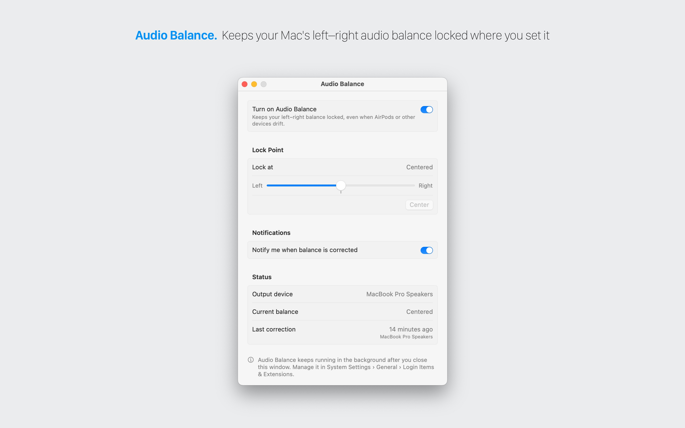

<p align="center">

</p>

<h1 align="center">Audio Balance</h1>

Keeps your Mac's left–right audio balance locked where you set it. AirPods and some other devices sometimes drift off-center.



## Inspired by Balance Lock

Audio Balance is inspired by [Balance Lock](https://www.tunabellysoftware.com/balance_lock/) from Tunabelly Software. If you use an older Mac, Balance Lock is a good choice: it supports macOS 10.12 and later, while Audio Balance needs macOS 15. The main differences:

- Written in modern SwiftUI architecture.
- No menu bar icon: there's a settings window, plus a background agent you never see.
- The agent is bundled inside the app and registered as a login item with `SMAppService`.
- Open source.

## How it works

- **Background agent.** `Audio Balance Agent.app` ships inside `Audio Balance.app` in `Contents/Library/LoginItems` and is registered as a login item with `SMAppService`, so nothing is installed in `~/Library/LaunchAgents`. Both apps are sandboxed and share settings through an app group.
  - It listens for CoreAudio changes to the default output device and to that device's balance (virtual main balance, or stereo pan as a fallback).
  - When the balance drifts 2% or more from your lock point, the agent writes the lock point back.
  - It can optionally show a notification.
- **Settings app.** Turn Audio Balance on or off, choose the lock point, turn notifications on or off, and see the current device, its balance and the last correction. Closing the window leaves the agent running. You can also manage it in System Settings › General › Login Items & Extensions.

## Building

Requires Xcode 26 and macOS 15 or later. Set your own team in the project to build; the app group needs a team-signed build.

```sh
xcodebuild -scheme AudioBalance -destination 'platform=macOS' build test
```

The UI tests drive the real app. They register the background agent and change your output device's balance, then restore both. CI runs only the unit tests.

## Privacy

Audio Balance collects no data. See [PRIVACY.md](PRIVACY.md).

## License

GPLv3. See [LICENSE](LICENSE).
